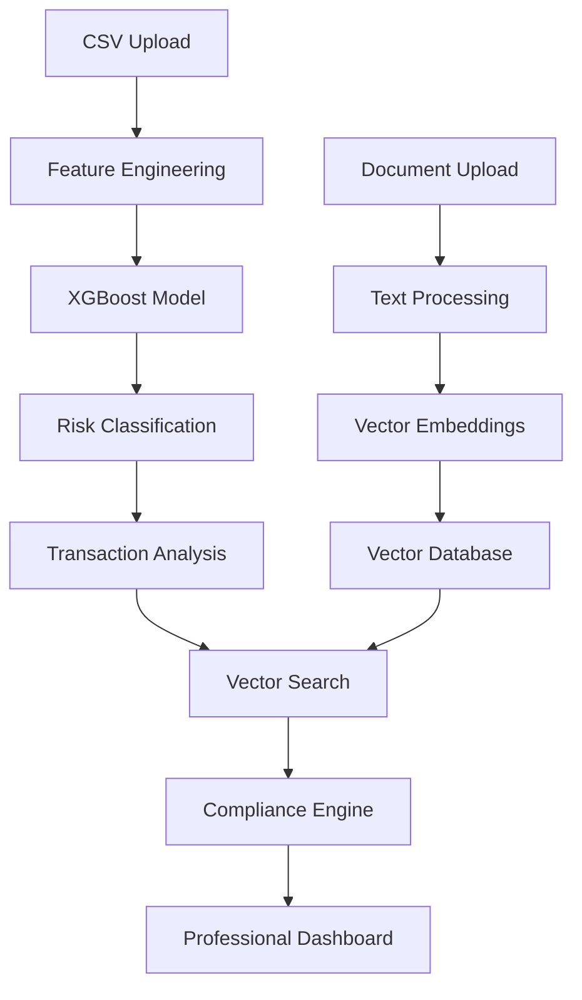

# 🏦 AML Transaction Screening Platform

**Enterprise-grade Anti-Money Laundering compliance system combining Machine Learning risk assessment with Retrieval-Augmented Generation (RAG) for intelligent regulatory analysis.**

[](https://python.org)
[](https://fastapi.tiangolo.com)
[](https://reactjs.org)
[](LICENSE)

## 🎯 **Overview**

This platform provides **real-time transaction monitoring** and **compliance analysis** using advanced machine learning and natural language processing. Built for financial institutions to detect suspicious activities, ensure regulatory compliance, and streamline AML operations.

### **🚀 Key Features**

- **🧠 Advanced ML Risk Assessment**: XGBoost model with 33 engineered features
- **📋 RAG-Powered Compliance Analysis**: Intelligent regulatory document search and analysis  
- **⚡ Real-time Processing**: Batch transaction screening with sub-second response times
- **🔍 Semantic Search**: Vector-based regulatory document retrieval
- **💼 Professional Banking UI**: Executive-level dashboard and analytics
- **🛡️ Production-Ready**: Comprehensive error handling, logging, and monitoring

---

## 🏗️ **System Architecture**



### **🔧 Technology Stack**

#### **Backend**
- **FastAPI** - High-performance async API framework
- **XGBoost** - Gradient boosting for transaction risk assessment
- **LangChain** - Document processing and text splitting
- **SentenceTransformers** - Semantic embeddings for RAG
- **scikit-learn** - Feature engineering and preprocessing
- **Pandas/NumPy** - Data manipulation and analysis

#### **Frontend**
- **React 18** - Modern component-based UI
- **Lucide React** - Professional icon system
- **CSS3** - Custom banking-grade styling

#### **Machine Learning Pipeline**
- **33 Engineered Features**: Temporal, amount-based, geographic, payment type, and velocity analytics
- **SMOTE Balancing**: Handles imbalanced transaction datasets
- **Precision-Recall Optimization**: Threshold tuning for optimal detection rates
- **Feature Importance Analysis**: Interpretable model decisions

#### **RAG System**
- **Document Processing**: Multi-format support (PDF, TXT, MD)
- **Intelligent Text Splitting**: Context-preserving chunk generation
- **Vector Storage**: Efficient similarity search with cosine distance
- **Semantic Retrieval**: Natural language regulatory queries

---

## 📊 **Model Performance**

| Metric | Value | Description |
|--------|--------|-------------|
| **Recall** | 85.2% | Suspicious transaction detection rate |
| **Precision** | 78.6% | Accuracy of suspicious classifications |
| **Features** | 33 | Engineered feature dimensions |
| **Threshold** | 0.0445 | Optimized classification boundary |
| **Processing Speed** | <2s | Average batch processing time |

---

## 🚀 **Quick Start**

### **Prerequisites**
- Python 3.8+
- Node.js 16+
- 8GB+ RAM (for ML model loading)

### **1. Clone Repository**
```bash
git clone https://github.com/Harshal875/AML-project.git
cd AML-project
```

### **2. Backend Setup**
```bash
cd backend

# Create virtual environment
python -m venv venv
source venv/bin/activate  # On Windows: venv\Scripts\activate

# Install dependencies
pip install -r requirements.txt

# Start backend server
python main.py
```
Backend runs on: `http://localhost:8000`

### **3. Frontend Setup**
```bash
cd frontend

# Install dependencies
npm install

# Start development server
npm start
```
Frontend runs on: `http://localhost:3000`

### **4. Access Application**
- **Main Application**: http://localhost:3000
- **API Documentation**: http://localhost:8000/docs
- **Health Check**: http://localhost:8000/health

---

## 📁 **Project Structure**

```
AML-project/
├── backend/
│   ├── compliance/          # RAG compliance engine
│   │   ├── compliance_engine.py
│   │   ├── document_processor.py
│   │   ├── llm_analyzer.py
│   │   ├── transaction_analyzer.py
│   │   ├── vector_store.py
│   │   └── routes.py
│   ├── models/              # Trained ML models
│   │   ├── trained_aml_model.pkl
│   │   ├── scaler.pkl
│   │   ├── encoders.pkl
│   │   └── feature_columns.pkl
│   ├── data/                # Data storage
│   │   ├── regulatory_docs/
│   │   └── local_vectors/
│   └── main.py              # FastAPI application
├── frontend/
│   ├── src/
│   │   ├── components/      # React components
│   │   │   ├── Dashboard.js
│   │   │   ├── TransactionMonitoring.js
│   │   │   ├── ComplianceCenter.js
│   │   │   └── RegulatoryLibrary.js
│   │   ├── App.js
│   │   └── App.css
│   └── public/
└── README.md
```

---

## 🔌 **API Endpoints**

### **Core Endpoints**
| Method | Endpoint | Description |
|--------|----------|-------------|
| `GET` | `/` | System overview and capabilities |
| `GET` | `/health` | System health check |
| `GET` | `/stats` | Processing statistics |

### **Compliance Endpoints**
| Method | Endpoint | Description |
|--------|----------|-------------|
| `POST` | `/compliance/enhanced-csv-upload` | **Main endpoint**: Full ML + RAG analysis |
| `POST` | `/compliance/upload-regulation` | Upload regulatory documents |
| `POST` | `/compliance/search-regulations` | Semantic regulatory search |
| `GET` | `/compliance/health` | Compliance system health |
| `GET` | `/compliance/stats` | Compliance statistics |

---

## 💼 **Usage Examples**

### **1. Transaction Screening**
```bash
curl -X POST "http://localhost:8000/compliance/enhanced-csv-upload" \
  -H "Content-Type: multipart/form-data" \
  -F "file=@transactions.csv"
```

### **2. Regulatory Document Upload**
```bash
curl -X POST "http://localhost:8000/compliance/upload-regulation" \
  -H "Content-Type: multipart/form-data" \
  -F "file=@regulation.pdf" \
  -F "title=BSA Requirements" \
  -F "jurisdiction=United States" \
  -F "regulation_type=AML"
```

### **3. Regulatory Search**
```bash
curl -X POST "http://localhost:8000/compliance/search-regulations" \
  -H "Content-Type: application/json" \
  -d '{"question": "currency transaction reporting requirements", "max_results": 5}'
```

---

## 📊 **Sample CSV Format**

```csv
Time,Date,Sender_account,Receiver_account,Amount,Payment_currency,Received_currency,Sender_bank_location,Receiver_bank_location,Payment_type
14:30:00,2024-01-15,ACC001,ACC002,5000,USD,USD,USA,USA,Wire Transfer
09:15:00,2024-01-15,ACC003,ACC004,15000,USD,USD,USA,Canada,ACH
16:45:00,2024-01-15,ACC005,ACC006,9500,USD,USD,USA,Nigeria,Cash Deposit
```

---

## 🛠️ **Development**

### **Adding New Features**
1. **Backend**: Add endpoints in `routes.py`, implement logic in respective modules
2. **Frontend**: Create components in `src/components/`, integrate with API calls
3. **ML Model**: Retrain model with new features, update preprocessing pipeline

### **Testing**
```bash
# Backend testing
cd backend
python -m pytest

# Frontend testing  
cd frontend
npm test
```

### **Code Quality**
```bash
# Python linting
flake8 backend/
black backend/

# JavaScript/React linting
cd frontend
npm run lint
```

---

## 🔒 **Security & Compliance**

- **Data Privacy**: No sensitive data stored permanently
- **Input Validation**: Comprehensive request validation using Pydantic
- **Error Handling**: Secure error messages without data leakage
- **CORS Configuration**: Configurable for production deployment
- **Regulatory Compliance**: Implements real BSA/AML requirements

---

## 🚀 **Deployment**

### **Docker Deployment**
```bash
# Build and run with Docker Compose
docker-compose up --build
```

### **Production Environment Variables**
```env
API_HOST=0.0.0.0
API_PORT=8000
LOG_LEVEL=INFO
OPENAI_API_KEY=your_key_here  # Optional for enhanced LLM features
```

---

## 📈 **Performance Optimization**

- **Batch Processing**: Vectorized operations for large transaction datasets
- **Model Caching**: Persistent model loading for faster inference
- **Vector Storage**: Efficient similarity search with optimized indexing
- **Async Processing**: Non-blocking API operations with FastAPI

---

## 🤝 **Contributing**

1. Fork the repository
2. Create feature branch (`git checkout -b feature/AmazingFeature`)
3. Commit changes (`git commit -m 'Add AmazingFeature'`)
4. Push to branch (`git push origin feature/AmazingFeature`)
5. Open Pull Request

---

## 📄 **License**

This project is licensed under the MIT License - see the [LICENSE](LICENSE) file for details.

---

## 👨‍💻 **Author**

**Harshal** - [GitHub](https://github.com/Harshal875)

---

## 🙏 **Acknowledgments**

- **Scikit-learn** for machine learning utilities
- **FastAPI** for the excellent API framework
- **LangChain** for document processing capabilities
- **React** for the frontend framework
- Financial industry experts for AML compliance guidance

---

## 📞 **Support**

For questions or support, please:
1. Check the [Issues](https://github.com/Harshal875/AML-project/issues) page
2. Create a new issue with detailed description
3. Include relevant logs and error messages

---

**⭐ Star this repository if you found it helpful!**